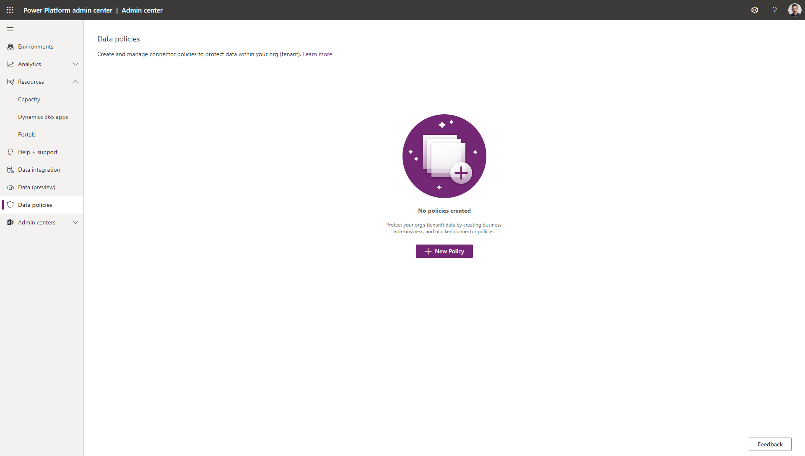
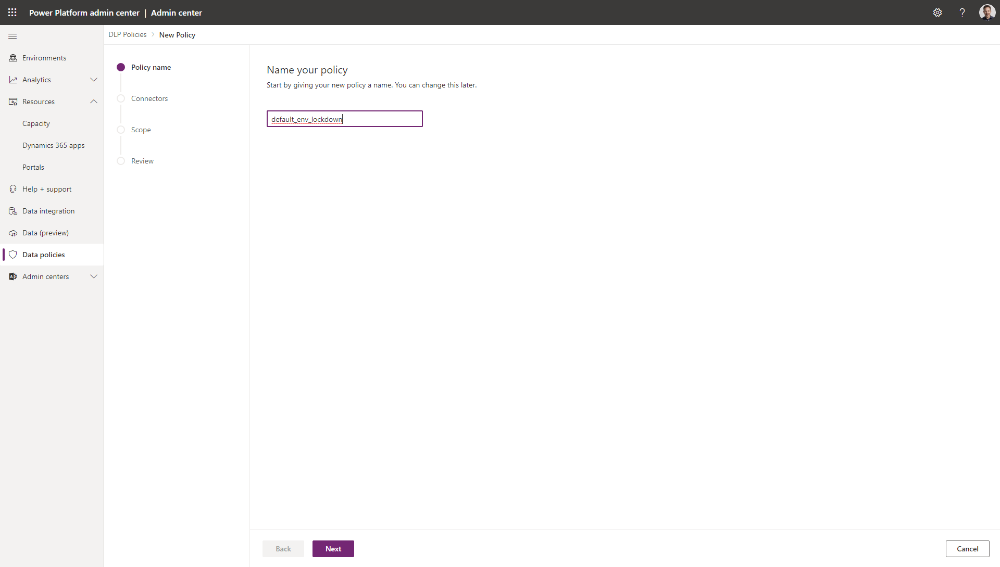
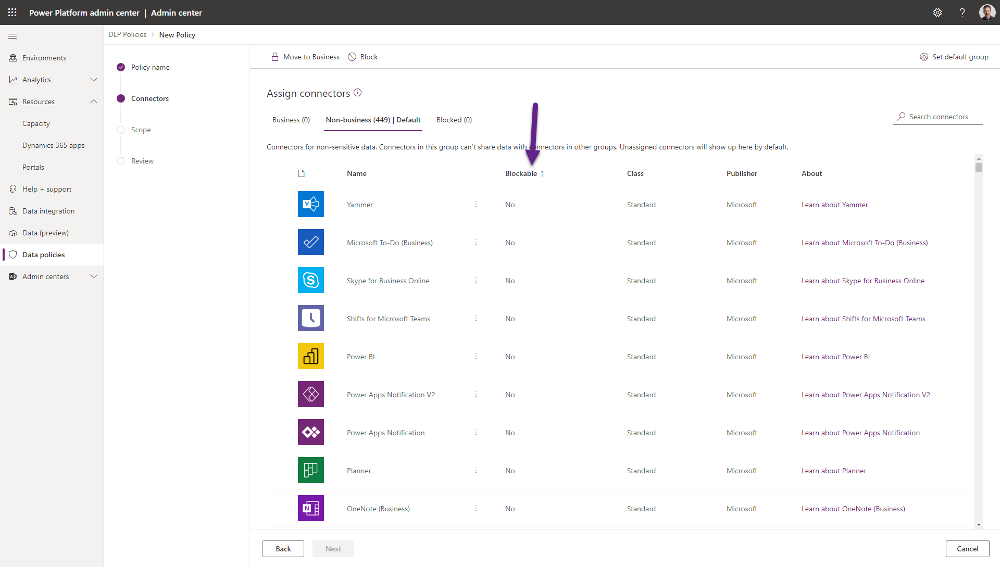
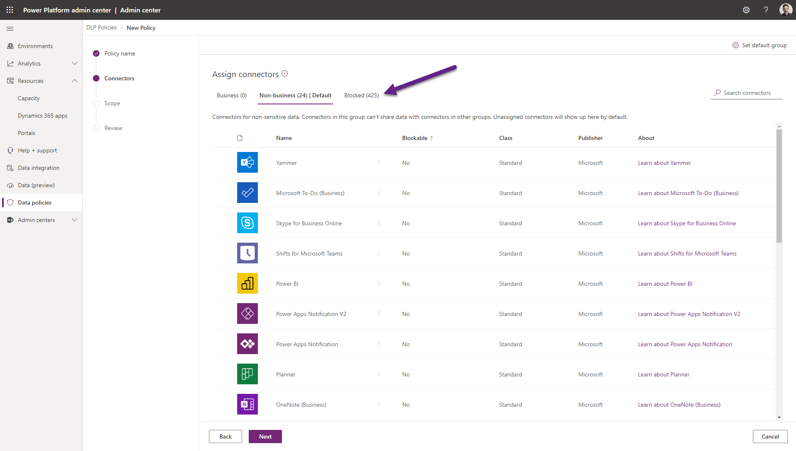
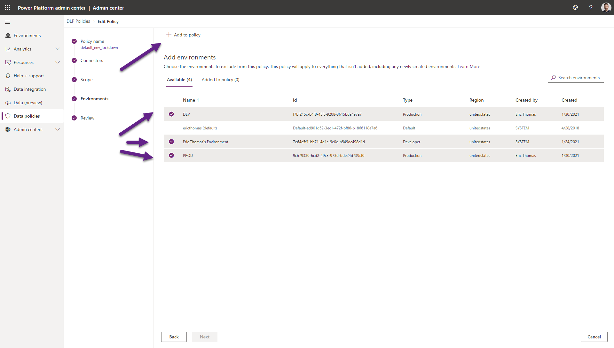
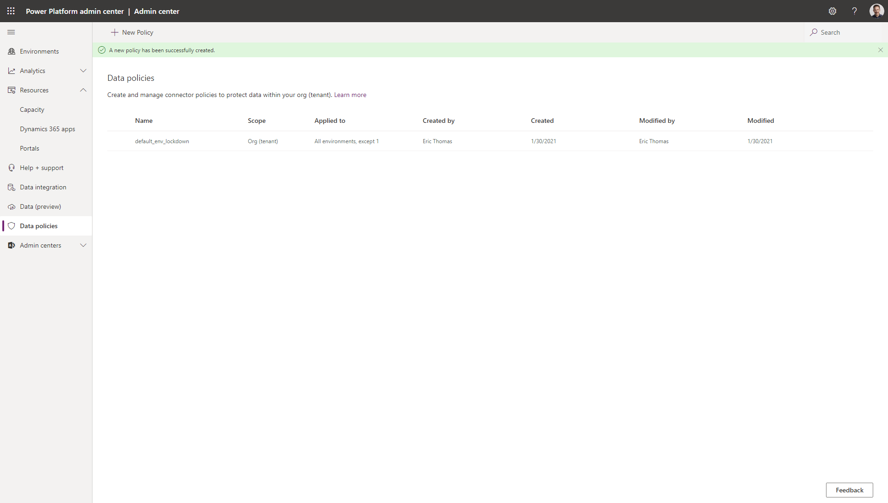

**Why create a strict DLP for your default env?**

All licensed PowerApps users (PowerApps-specific, D365 or certain O365 licenses) have `Environment Maker` role in the [`default` env](https://docs.microsoft.com/en-us/power-platform/admin/environments-overview#the-default-environment). You cannot turn this off. That means anyone in your org with a license can create a PowerApp in the `default` env. If you have no Data Loss Prevention (DLP) policies in place, user's could create apps that use connectors you do not approve of.

By setting a special DLP for the `default` environment, you "lock down" the environment to only allow certain connections to be made within PowerApps (OneDrive, Sharepoint, etc.) thus better protecting your data. 

**Pre-requisites**
- You will need `Environment Admin` [permissions](https://docs.microsoft.com/en-us/power-platform/admin/database-security#predefined-security-roles).

**Steps to complete**
1. Visit `admin.powerplatform.com`
2. Select `Data policies` then `+ New Policy`

3. Name the DLP. Be sure to include the words `default_env` as it only applies to this environment
4. Click `Next`

5. Click the `Blockable` column to show all `No` values first

6. Select all Connectors then deselect all `No` values
7. Click `the three dots` next to one of the Blockable Connectors and select `Block`
  - This will move all selected Connectors to the `Blocked` tab
  - Users will now ONLY be able to connect to Microsoft connectors
8. Click `Next`

9. Select `Exclude certain environments` from the Define Scope screen the click `Next`

10. Select all environments *except* the `default` environment then click `Add to policy`
**Critical:** The UI is misleading here. Because you selected `Exclude certain environments` from the previous step, you are actually selecting environments to *exclude* from the policy (even though the heading says "Add to policy"!)

11. Review to ensure all items look correct then click `Create policy`

**Next steps**
- After the `default` env has the strictest DLP in place, create a `DEV` and a `PROD` environment to provide a natural progression for app developers. You can create less restrictive DLP's for these environments.
